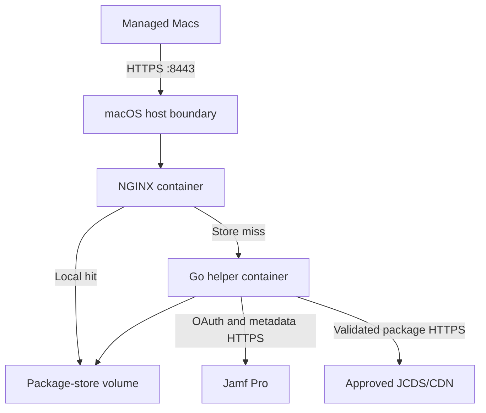

# Production architecture

**Status:** Draft for production-target review  
**Target:** Dedicated Mac running Docker Desktop  
**Last updated:** 31 August 2026

## 1. Architecture decision

The first production deployment will run on macOS with Docker Desktop rather
than Ubuntu with Docker Engine. The package-delivery application remains an
NGINX gateway plus a Go download helper. Docker Desktop supplies the Linux VM,
container runtime, Compose implementation, container network and persistent
volume layer.

The localhost-only profile in `deploy/macos/` proves the real Jamf/JCDS data
path, but it is not the production deployment. A separate macOS production
profile must add downstream TLS, LAN exposure, host access controls, managed
startup, capacity controls, monitoring and recovery procedures.

## 2. Logical topology

The final and temporary package paths remain `/srv/jamf-store/packages/` and
`/srv/jamf-store/.temporary/` inside the Linux containers. The macOS storage
representation backing that container path is a separate production decision.

## 3. Component responsibilities

| Component | Responsibility |
|---|---|
| Dedicated Mac | Physical availability, macOS lifecycle, network, time, power and Docker Desktop startup |
| Docker Desktop | Linux VM, Docker Engine, Compose, container networking, image storage and persistent-volume implementation |
| NGINX | TLS termination, client method/path controls, local static delivery, miss routing and privacy-safe request telemetry |
| Go helper | OAuth, Jamf catalog/resolver access, destination validation, streaming, SHA3-512/length verification and atomic publication |
| Package-store volume | Immutable completed packages and hidden same-filesystem temporary downloads |
| Operations integration | Health monitoring, logs, alerts, certificate expiry, capacity, controlled updates and recovery |

## 4. Security boundaries

- Only NGINX publishes TCP 8443. The helper remains private to the Docker
  network.
- No host firewall, source-CIDR filtering or client authentication is used.
  A live LAN test proved that Docker Desktop replaces the real client address
  with `192.168.65.1`, making NGINX source filtering ineffective. The service
  owner explicitly accepted access by any client able to route to TCP 8443.
- NGINX terminates server-authenticated TLS for
  `jcds-cache.appfruit.ch`. Certificate and private-key material is mounted
  read-only from a protected macOS directory or delivered through an approved
  replacement mechanism.
- The Jamf secret is stored outside Git in a protected host file and injected
  only into the helper. Docker administrators can inspect container environment
  values and are therefore privileged service administrators.
- The helper accepts a canonical filename, never a client-supplied URL. Every
  resolved URL and redirect remains subject to exact-host, HTTPS, DNS-address
  and destination checks.
- The package store is derived and rebuildable. Configuration, certificates,
  deployment metadata and recovery procedures require protection; cached
  package bytes do not require authoritative backup unless operations chooses
  to preserve pre-populated content.

## 5. Storage architecture

Production will use a Docker named volume at `/srv/jamf-store`. Docker Desktop
stores that volume inside its managed Linux VM disk image on APFS-backed Mac
storage. This matches the storage model already proven by the real-backend test
and avoids making production depend on the bind-mount path that previously
exposed I/O and ownership failures.

The store targets an approximately 500–600 GB package working set. A separate
hardened maintainer uses a restricted access index and configurable defaults of
90 days inactivity, cleanup below 30 percent free space and recovery to 35
percent. Temporary and final paths remain in the same named volume for atomic
rename. Package inventory, inspection and cleanup must be
available from macOS through supported Docker commands or purpose-built
administrative commands. A named volume does not make its files directly
browsable as ordinary Finder files; the service owner has confirmed that
Docker/administrative access from macOS satisfies the visibility requirement.

## 6. Availability and lifecycle

Docker Desktop is a macOS user application backed by a Linux VM, not a normal
host-level Docker Engine service. Production readiness therefore requires
evidence for:

- unattended recovery after a Mac reboot;
- whether a dedicated macOS account must remain logged in;
- Docker Desktop startup and container recreation after login/restart;
- Resource Saver being disabled for the always-on service;
- controlled macOS and Docker Desktop update windows;
- recovery from Docker Desktop VM/disk-image failure or reset;
- network and package delivery after sleep, power loss and interface changes;
- capacity and performance with the agreed package workload.

The first deployment remains a single point of failure. A higher availability
target requires a second cache node, a client failover mechanism or a different
server platform.

## 7. Confirmed architecture decisions

| ID | Decision |
|---|---|
| AD-01 | Production runs on macOS with Docker Desktop. |
| AD-02 | NGINX and the Go helper remain separate containers. |
| AD-03 | The helper retains OAuth/Jamf/JCDS logic; clients never receive upstream credentials or signed URLs. |
| AD-04 | Final files retain their canonical original filename; opaque NGINX proxy-cache storage is not authoritative. |
| AD-05 | `jcds-cache.appfruit.ch:8443` uses server-authenticated TLS but no source-CIDR filtering or client authentication; any route-reachable client may request packages. |
| AD-06 | Package names are immutable and publication requires exact catalog length and SHA3-512 verification. |
| AD-07 | The current `deploy/macos/` stack remains a localhost integration profile, not the production listener. |
| AD-08 | The host is a dedicated wired Mac mini with 24 GB RAM and 1 TB APFS storage. |
| AD-09 | Use Docker Desktop under the organization-approved paid entitlement available for this production workload. |
| AD-10 | Docker Desktop runs under a dedicated macOS account and fully automatic recovery must be demonstrated. |
| AD-11 | Production package storage uses a Docker named volume in Docker Desktop's APFS-backed VM disk image. |
| AD-12 | Prefer a non-root helper; UID 0 requires explicit approval and retains all-capabilities-dropped, no-new-privileges and read-only-root controls. |

## 8. Blocking production decisions

| ID | Decision required | Recommended starting position |
|---|---|---|
| OQ-16 | Exact login/startup mechanism and recovery evidence | Dedicated account selected; prove power-on-to-healthy recovery without manual interaction before pilot |
| OQ-19 | Docker Desktop CPU, RAM, disk limit, Resource Saver and update policy | Disable Resource Saver; assign fixed resources and controlled update windows through managed settings |
| OQ-20 | Cache backup/rebuild and Docker Desktop disaster recovery | Treat package bytes as rebuildable; back up only configuration/certificates and test empty-cache recovery |

The first `deploy/macos-production/` implementation is available for
engineering validation. OQ-18 is resolved by removing source filtering after
Docker Desktop source-address masking was demonstrated. OQ-21 is resolved by
the successful non-root target-Mac validation. OQ-16, OQ-17, OQ-19 and OQ-20
retain evidence or policy gates before the pilot.
