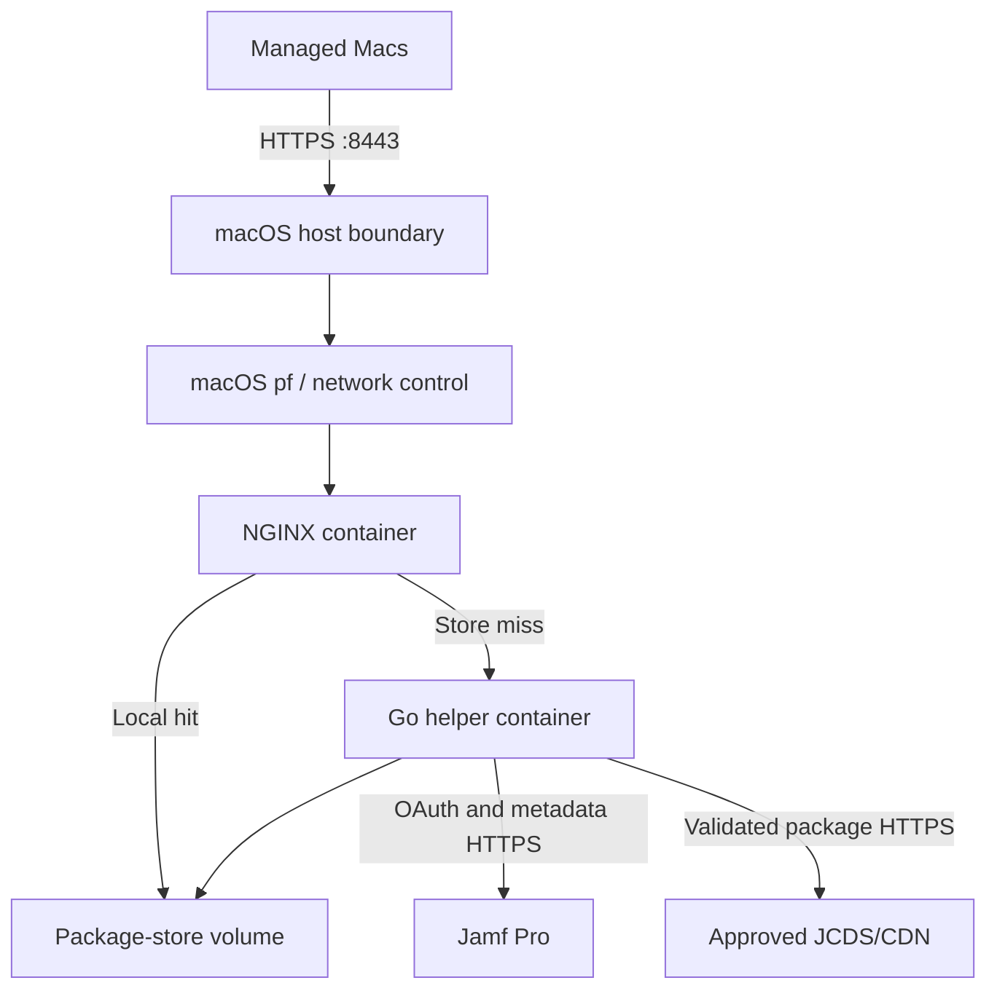

# Production architecture

**Status:** Draft for production-target review  
**Target:** Dedicated Mac running Docker Desktop  
**Last updated:** 30 August 2026

## 1. Architecture decision

The first production deployment will run on macOS with Docker Desktop rather
than Ubuntu with Docker Engine. The package-delivery application remains an
NGINX gateway plus a Go download helper. Docker Desktop supplies the Linux VM,
container runtime, Compose implementation, container network and persistent
volume layer.

The localhost-only profile in `deploy/macos/` proves the real Jamf/JCDS data
path, but it is not the production deployment. A separate macOS production
profile must add downstream TLS, LAN exposure, host access controls, managed
startup, capacity controls, monitoring and recovery procedures.

## 2. Logical topology

The final and temporary package paths remain `/srv/jamf-store/packages/` and
`/srv/jamf-store/.temporary/` inside the Linux containers. The macOS storage
representation backing that container path is a separate production decision.

## 3. Component responsibilities

| Component | Responsibility |
|---|---|
| Dedicated Mac | Physical availability, macOS lifecycle, network, time, power, host firewall and Docker Desktop startup |
| Docker Desktop | Linux VM, Docker Engine, Compose, container networking, image storage and persistent-volume implementation |
| NGINX | TLS termination, client method/path controls, local static delivery, miss routing and privacy-safe request telemetry |
| Go helper | OAuth, Jamf catalog/resolver access, destination validation, streaming, SHA3-512/length verification and atomic publication |
| Package-store volume | Immutable completed packages and hidden same-filesystem temporary downloads |
| Operations integration | Health monitoring, logs, alerts, certificate expiry, capacity, controlled updates and recovery |

## 4. Security boundaries

- Only NGINX publishes TCP 8443. The helper remains private to the Docker
  network.
- The macOS host or perimeter firewall is the primary source-CIDR enforcement
  point. NGINX CIDR controls are defense in depth only until Docker Desktop's
  source-address behavior is validated from the production LAN.
- NGINX terminates server-authenticated TLS for
  `jcds-cache.appfruit.ch`. Certificate and private-key material is mounted
  read-only from a protected macOS directory or delivered through an approved
  replacement mechanism.
- The Jamf secret is stored outside Git in a protected host file and injected
  only into the helper. Docker administrators can inspect container environment
  values and are therefore privileged service administrators.
- The helper accepts a canonical filename, never a client-supplied URL. Every
  resolved URL and redirect remains subject to exact-host, HTTPS, DNS-address
  and destination checks.
- The package store is derived and rebuildable. Configuration, certificates,
  deployment metadata and recovery procedures require protection; cached
  package bytes do not require authoritative backup unless operations chooses
  to preserve pre-populated content.

## 5. Storage architecture

The recommended starting position is a Docker-managed named volume because the
real-backend Mac test exposed Docker Desktop failures for a single-file host
bind mount and cross-UID ownership changes. A named volume preserves original
package filenames inside the container filesystem, but its bytes reside inside
Docker Desktop's Linux VM disk image rather than as directly browsable Finder
files.

Production approval requires a decision between:

1. **Docker named volume:** preferred compatibility; requires explicit Docker
   disk-image location, size, free-space monitoring, volume inspection and
   reset/recovery procedures.
2. **Dedicated APFS bind mount:** host-visible files; requires sustained
   throughput, atomic-rename, ownership, reboot and Docker Desktop update tests
   before acceptance.

Whichever option is selected must provide 500 GB–1 TB usable capacity, retain
at least 20 percent headroom, keep temporary and final paths on the same
filesystem and support atomic rename.

## 6. Availability and lifecycle

Docker Desktop is a macOS user application backed by a Linux VM, not a normal
host-level Docker Engine service. Production readiness therefore requires
evidence for:

- unattended recovery after a Mac reboot;
- whether a dedicated macOS account must remain logged in;
- Docker Desktop startup and container recreation after login/restart;
- Resource Saver being disabled for the always-on service;
- controlled macOS and Docker Desktop update windows;
- recovery from Docker Desktop VM/disk-image failure or reset;
- network and package delivery after sleep, power loss and interface changes;
- capacity and performance with the agreed package workload.

The first deployment remains a single point of failure. A higher availability
target requires a second cache node, a client failover mechanism or a different
server platform.

## 7. Confirmed architecture decisions

| ID | Decision |
|---|---|
| AD-01 | Production runs on macOS with Docker Desktop. |
| AD-02 | NGINX and the Go helper remain separate containers. |
| AD-03 | The helper retains OAuth/Jamf/JCDS logic; clients never receive upstream credentials or signed URLs. |
| AD-04 | Final files retain their canonical original filename; opaque NGINX proxy-cache storage is not authoritative. |
| AD-05 | `jcds-cache.appfruit.ch:8443` and client CIDR `192.168.0.0/16` remain the intended service boundary. |
| AD-06 | Package names are immutable and publication requires exact catalog length and SHA3-512 verification. |
| AD-07 | The current `deploy/macos/` stack remains a localhost integration profile, not the production listener. |

## 8. Blocking production decisions

| ID | Decision required | Recommended starting position |
|---|---|---|
| OQ-14 | Dedicated Mac model, Apple silicon generation, RAM, internal storage and external-storage use | Dedicated wired Mac mini with at least 16 GB RAM; 24–32 GB preferred |
| OQ-15 | Docker Desktop commercial subscription and enterprise ownership | Docker Business owned and managed by the enterprise |
| OQ-16 | Unattended startup and macOS session model | Dedicated service account; prove restart recovery without manual intervention before pilot |
| OQ-17 | Named volume versus APFS bind mount and Docker disk-image placement | Named volume with Docker disk image on sufficiently large managed APFS storage |
| OQ-18 | Host firewall mechanism and source-address visibility | Enforce CIDR at macOS/perimeter firewall; test actual client IP visibility before relying on NGINX allow/deny |
| OQ-19 | Docker Desktop CPU, RAM, disk limit, Resource Saver and update policy | Disable Resource Saver; assign fixed resources and controlled update windows through managed settings |
| OQ-20 | Cache backup/rebuild and Docker Desktop disaster recovery | Treat package bytes as rebuildable; back up only configuration/certificates and test empty-cache recovery |
| OQ-21 | Production helper UID model under Docker Desktop named-volume ownership behavior | Prefer non-root; if Docker Desktop prevents it, document and approve UID 0 with all capabilities dropped and a read-only root filesystem |

Implementation of `deploy/macos-production/` may begin after OQ-14 through
OQ-18 and OQ-21 are answered. OQ-19 and OQ-20 must be resolved before the
production pilot begins.
