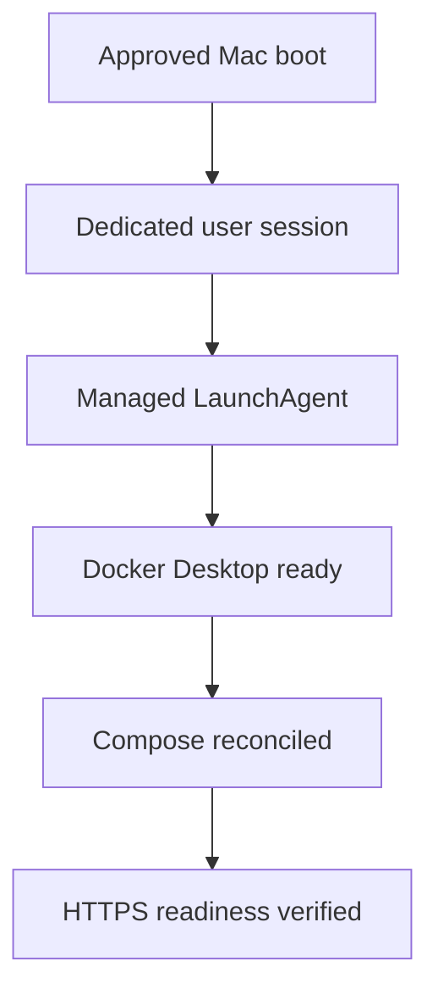

# Production readiness plan

**Status:** Active plan

**Target:** Dedicated Mac mini running licensed Docker Desktop

**Last updated:** 1 September 2026

This document is the retained plan for moving the validated macOS production
candidate to production approval. Completed technical evidence is recorded in
[`macos-production-validation-2026-08-31.md`](macos-production-validation-2026-08-31.md).

## 1. Unattended Mac recovery

### Confirmed prerequisite

FileVault and dedicated-account login behavior is handled outside this
repository and is confirmed as resolved by the service owner. The operational
acceptance test must still demonstrate that the resulting login sequence makes
the dedicated user's GUI session available after the approved reboot scenario.

### Implemented startup mechanism

Use a managed per-user `LaunchAgent`, not a normal system `LaunchDaemon`, to
start and supervise this Docker Desktop workload. Docker Desktop is a
GUI-session application; a root LaunchDaemon does not by itself provide the
required user bootstrap namespace and is therefore the wrong primary lifecycle
mechanism.

The implemented idempotent controller performs this sequence:

1. Run in the dedicated service account's GUI session at login.
2. Start `/Applications/Docker.app` with `open -gja` if Docker Desktop is not
   already running.
3. Poll `docker info` with a bounded timeout until the Docker engine is ready.
4. Run `docker compose up --detach --no-build` with the reviewed
   `deploy/macos-production/compose.yaml`, the optional monitoring override and
   protected deployment environment.
5. Wait until `cache-helper`, `cache-maintainer` and `nginx` report healthy.
6. Verify the trusted HTTPS readiness endpoint.
7. Write a credential-free result to a protected operational log and return a
   non-zero status on failure for monitoring or MDM collection.
8. Repeat every five minutes or when invoked by management so recovery does
   not depend only on the initial login event.

Compose retains `restart: unless-stopped`; this restarts containers after the
Docker engine returns. The LaunchAgent closes the remaining gap by starting
Docker Desktop and reconciling the Compose application itself.

The implementation consists of the managed plist under
`deploy/macos-production/`, the credential-free controller and management
scripts under `scripts/`, and the automated controller test under
`tests/integration/`. The controller uses bounded waits, never disables TLS
validation, never builds during recovery and pins the reviewed Compose files by
SHA-256. Installation and cold-boot acceptance are documented in
[`macos-unattended-recovery.md`](macos-unattended-recovery.md).

### How reachability without manual intervention is achieved

No operator action is required when every transition succeeds. The controller
records a credential-free timestamp for each transition. A cold-boot test must
still prove the service is reachable from a second Mac. OQ-16 remains in review
until that target-Mac test passes.

## 2. Docker Desktop operating parameters

The service owner will configure and own Docker Desktop CPU, memory, swap,
disk-image size, Resource Saver and update behavior. The repository retains the
requirements and acceptance checks, but does not manage these settings until
the owner supplies the final values.

Minimum retained requirements:

- Resource Saver disabled for the always-on service;
- enough Docker disk capacity for the approved cache budget plus headroom;
- controlled Docker Desktop and macOS update windows;
- health validation after every update;
- settings and subscription ownership documented outside credential files.

## 3. Storage and cache lifecycle

### Capacity target for a 1 TB Mac

A 1 TB Mac cannot provide a 1 TB usable package cache while also holding macOS,
Docker images, logs, temporary downloads and recovery headroom. The planning
target is:

- approximately 500–600 GB usable package cache;
- approximately 650–700 GB maximum Docker Desktop disk-image allocation;
- at least 30 percent free space at the package-store filesystem boundary;
- separate observation of host APFS free space and Docker filesystem free
  space because either can become the limiting layer.

These are planning defaults until the service owner supplies the final Docker
Desktop settings and measured package distribution.

### Low-disk and retention policy

The selected policy is conditional cleanup:

1. Trigger cleanup when package-store free space falls below 30 percent.
2. Consider only completed package files not requested for 90 days by default.
3. Delete eligible files in oldest-last-access order.
4. Stop after free space reaches a recovery target above the trigger; the
   default target is 35 percent.
5. Never delete active `.part` files, unrelated files, symbolic links or files
   involved in an active fill.
6. If no eligible file remains, reject new fills through existing capacity
   protection rather than breaching the free-space floor. Local files remain
   available.

All lifecycle values are deployment-time settings. The defaults are
`JCDS_CACHE_RETENTION=2160h`,
`JCDS_CACHE_CLEANUP_TRIGGER_FREE_PERCENT=30` and
`JCDS_CACHE_CLEANUP_TARGET_FREE_PERCENT=35`; changing them does not require an
image rebuild.

Filesystem `atime` is not an acceptable source of truth: Docker and filesystem
mount behavior may suppress or coarsen access-time updates, and NGINX `sendfile`
does not provide a portable last-access contract. Accurate retention therefore
uses a local access index.

Implemented design:

- retain the detailed NGINX request log on stdout with package names, the
  observed client address and an explicit allowlist of diagnostic headers;
- send successful `200` and `206` package-access events over internal UDP
  syslog to the `cache-maintainer` service;
- store canonical filename and last-access time in a mode-`0600` index in a
  separate restricted maintenance volume, never in normal centralized logs;
- have `cache-maintainer` validate candidates with `Lstat` and remove only
  eligible regular completed `.pkg` files;
- keep filename-bearing deletion audit records only in the restricted
  maintenance volume;
- flush the index every 30 seconds and check capacity every 15 minutes by
  default; both intervals are configurable.

The private UDP event stream is best effort. A lost event can cause rebuildable
cache data to be evicted early, but cannot modify the authoritative Jamf source.
Controlled disk-pressure acceptance remains required before pilot approval.

Administrative inventory and ad-hoc deletion commands are deferred because the
service owner does not currently require them. Automatic cleanup will still
need internal inventory primitives to make safe decisions.

## 4. Recovery from a deleted or damaged Docker volume

Package bytes are derived data and may be rebuilt from JCDS. Configuration,
certificate material, environment files, reviewed images/commit and runbooks
are authoritative recovery inputs and must remain outside the package volume.

### Deleted or intentionally recreated volume

1. Confirm the exact Compose project and volume name.
2. Stop the application without broad or wildcard deletion commands.
3. Recreate the application with the reviewed Compose profile.
4. `store-init` recreates `/srv/jamf-store/packages` and `.temporary` with the
   approved permissions.
5. Verify TLS readiness and an empty-cache real fill.
6. Allow packages to repopulate on demand from JCDS.

### Suspected corruption

1. Stop writes by stopping `cache-helper`; preserve NGINX local reads when safe.
2. Capture Docker diagnostics and the exact volume identity.
3. Determine whether intact completed regular files can be trusted and
   exported; do not serve or import partial or ambiguous objects.
4. Obtain explicit approval before deleting or replacing the affected volume.
5. Recreate an empty volume and validate a real fill, local hit and integrity
   check.

### Docker Desktop VM-disk loss or reset

Reinstall or reset Docker Desktop as required, restore only configuration and
TLS material from managed sources, check out the approved repository commit,
recreate the Compose application and repopulate the cache. Package-volume
backup is not required unless a future requirement makes pre-populated bytes
authoritative.

This procedure passed on the target Mac through a separately named Compose
project. Both labeled test volumes were deleted only after exact target
enumeration, Compose recreated an empty service, the package was rehydrated
from JCDS and matched the private pre-deletion hash, and the production service
remained ready. OQ-20 is resolved for the pilot.

## 5. Retained open decisions

| ID | Decision or evidence still required |
|---|---|
| OQ-16 | LaunchAgent controller implemented; pass cold-boot-to-HTTPS recovery on the target Mac |
| OQ-17 | Validate final disk sizing, macOS reboot and Docker update behavior |
| OQ-19 | Record service-owner Docker resource and update settings |
| OQ-10 | Select monitoring platform, alert routing and retention |
