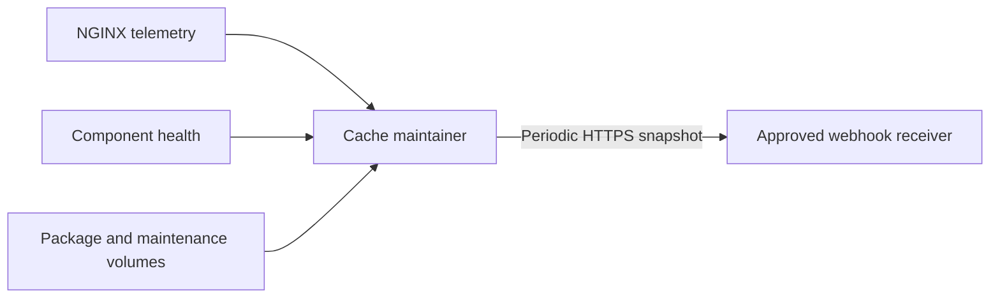

# Webhook monitoring

**Status:** Phase 1 implemented; target-Mac acceptance pending

**Target component:** `cache-maintainer`

**Last updated:** 31 August 2026

## 1. Purpose and boundary

The production cache extends the existing `cache-maintainer` with a
periodic reporter. The reporter sends a current, privacy-bounded service
snapshot to a dynamically configured HTTPS webhook. It does not participate in
package delivery, cache publication, cleanup decisions or gateway readiness.

Webhook failure must never make NGINX, the helper or the maintainer unhealthy,
and must never delay a package request. The reporter runs on a separate bounded
schedule inside the maintainer. An internal self-check cannot prove that the
service is reachable from a managed Mac, so an external HTTPS probe remains
recommended for end-to-end availability monitoring.

No Docker socket will be mounted into the maintainer. Docker Desktop, macOS,
APFS and cold-boot state therefore require host-side or external monitoring.

## 2. Data flow



NGINX's internal event schema carries safe aggregate fields such
as source, status, byte count, latency and range classification. Helper
failures that are not visible in those events need a bounded internal metrics
snapshot or sanitized event path. Neither path may include a package URI,
credential, token or signed URL.

## 3. Configuration

The names below define the implemented contract. Reporting is activated only
when `deploy/macos-production/compose.monitoring.yaml` is included.

| Variable | Default | Purpose |
|---|---:|---|
| `METRICS_WEBHOOK_ENABLED` | `false` | Explicit opt-in switch |
| `METRICS_WEBHOOK_URL` | empty | Exact HTTPS receiver URL |
| `METRICS_WEBHOOK_INTERVAL` | `60s` | Snapshot interval |
| `METRICS_WEBHOOK_TIMEOUT` | `10s` | Per-attempt request timeout |
| `METRICS_WEBHOOK_ALLOWED_HOSTS` | empty | Comma-separated exact receiver hostnames |
| `METRICS_WEBHOOK_ALLOW_PRIVATE_IPS` | `false` | Explicitly allow an approved receiver in private address space |
| `METRICS_WEBHOOK_AUTH_MODE` | `none` | Implemented values: `none` or `hmac` |
| `METRICS_WEBHOOK_HMAC_SECRET_FILE` | empty | Preferred protected-file reference for HMAC mode |
| `METRICS_WEBHOOK_MAX_ATTEMPTS` | `3` | Total attempts per snapshot; valid range 1–5 |
| `METRICS_INSTANCE_NAME` | empty | Operator-friendly cache name |
| `METRICS_INSTANCE_UUID` | generated | Explicit stable UUID or persisted generated UUID |
| `METRICS_INSTANCE_FQDN` | empty | Client-facing FQDN |
| `METRICS_INSTANCE_VERSION` | `unknown` | Deployed application version |
| `METRICS_INSTANCE_COMMIT` | `unknown` | Reviewed Git revision |
| `METRICS_PACKAGE_INVENTORY` | `summary` | `none`, `summary`, or `full` |
| `METRICS_PACKAGE_INVENTORY_MAX_ITEMS` | `5000` | Hard cap in `full` mode |
| `METRICS_TLS_CERT_FILE` | empty | Read-only public certificate or full-chain PEM inspected by the reporter |
| `METRICS_TLS_WARNING_BEFORE` | `720h` | Warning threshold; 30 days by default |
| `METRICS_TLS_CRITICAL_BEFORE` | `336h` | Critical threshold; 14 days by default |
| `METRICS_HEALTH_URL` | `http://nginx:8080/health/ready` | Private gateway readiness endpoint |

If no UUID is configured, the maintainer generates one once and stores it with
mode `0600` in the maintenance volume, for example at
`/srv/jamf-maintenance/instance-id`. Changing containers must not change the
identity. A missing URL, allowlist or required authentication secret while the
feature is enabled is a startup configuration error for the reporter, but must
not disable cache delivery or cleanup.

The HMAC secret must be a regular file containing at least 32 bytes. It may be
owner-only or group-readable only when the file group exactly matches the
maintainer's effective GID `0`; group write/execute and all `other` permissions
are rejected. It is re-read for each snapshot so a protected atomic file
replacement can rotate it without rebuilding the image.

The maintainer receives only the public certificate or full-chain PEM through
a dedicated read-only mount. It must never receive or mount the TLS private
key. Warning and critical durations must be positive, and the warning duration
must be greater than or equal to the critical duration.
When webhook reporting is enabled, the public certificate path is required.
Failure to read or parse it after startup must produce an `unknown` TLS status
in subsequent snapshots rather than stopping reporting, cleanup or delivery.

## 4. Snapshot contract

Every request uses JSON with a versioned schema. The receiver should treat
unknown fields as forward-compatible additions.

```json
{
  "schema_version": 1,
  "event_id": "3d939480-f681-4ea7-a2f0-07f2e21372cc",
  "sequence": 42,
  "observed_at": "2026-08-31T10:00:00Z",
  "instance": {
    "name": "JCDS Cache Production",
    "uuid": "2b1ab8d0-a064-47ca-af4e-366c53c43f10",
    "fqdn": "jcds-cache.appfruit.ch",
    "version": "v1.0.0",
    "commit": "0123456789abcdef",
    "uptime_seconds": 86400
  },
  "health": {
    "ready": true,
    "gateway_status": 200,
    "checked_at": "2026-08-31T10:00:00Z"
  },
  "tls": {
    "subject": "CN=jcds-cache.appfruit.ch",
    "not_after": "2027-08-31T12:00:00Z",
    "remaining_seconds": 31536000,
    "remaining_days": 365,
    "expiry_status": "ok"
  },
  "storage": {
    "total_bytes": 751619276800,
    "available_bytes": 300647710720,
    "free_percent": 40.0,
    "pressure": false,
    "cleanup_trigger_percent": 30,
    "cleanup_target_percent": 35
  },
  "cache": {
    "package_count": 120,
    "package_bytes": 214748364800,
    "temporary_count": 0,
    "temporary_bytes": 0,
    "index_entries": 120,
    "unindexed_entries": 0,
    "unsafe_entries": 0,
    "inventory_mode": "summary"
  },
  "traffic": {
    "window_seconds": 60,
    "requests": 25,
    "local_hits": 20,
    "jcds_fills": 5,
    "inflight_followers": 3,
    "hit_ratio": 0.8,
    "bytes_served": 123456789,
    "bytes_downloaded": 23456789,
    "request_seconds_total": 6.2,
    "request_seconds_average": 0.248,
    "request_seconds_max": 1.617,
    "status_2xx": 24,
    "status_4xx": 1,
    "status_5xx": 0,
    "range_requests": 3,
    "failures": 0
  },
  "cleanup": {
    "retention_seconds": 7776000,
    "last_result": "not_required",
    "last_completed_at": "2026-08-31T09:55:00Z",
    "removed_files_total": 4,
    "removed_bytes_total": 987654321
  },
  "reporter": {
    "previous_delivery_succeeded": true,
    "consecutive_failures": 0
  }
}
```

Traffic counters cover the interval since the previous snapshot. Cleanup
totals are monotonic since maintainer start. `event_id` supports receiver deduplication; `sequence`
helps detect missed or reordered snapshots. Cleanup result values are
`not_required`, `target_reached`, `target_not_reached`, and `failed`.

TLS expiry status values are `ok`, `warning`, `critical`, `expired`, and
`unknown`. `unknown` is used when the configured certificate cannot be read or
parsed. `remaining_seconds` is authoritative for alert calculations;
`remaining_days` is a rounded-down operator convenience. The subject is useful
for human identification, while issuer and serial number are intentionally
omitted from the baseline payload to keep it compact.

## 5. Package inventory and privacy

| Mode | Content |
|---|---|
| `none` | No cache inventory fields beyond operational totals required elsewhere |
| `summary` | Counts, byte totals, index consistency and temporary/unsafe entry counts |
| `full` | Summary plus at most the configured number of `{filename, size_bytes, last_access_at}` records |

`summary` is the production default. `full` is intended only for a trusted
receiver because filenames can disclose software inventory and large lists can
create operational load. Truncation must be explicit in the payload with the
total count and returned count.

The payload and reporter logs must exclude client addresses, Jamf tenant names,
OAuth material, signed URLs, package hashes, raw request IDs, raw headers and
per-client activity. The reporter must never log its request body or
authentication material.

## 6. Transport, authentication and failure behavior

- Accept HTTPS only, reject redirects and require an exact hostname allowlist.
- Resolve and dial the validated destination directly, without ambient proxy
  settings. Apply the same DNS/private-address and SSRF protections used for controlled
  outbound package requests, with explicit approval for the receiver's address
  class where necessary.
- Use a short timeout and bounded exponential retry.
- Keep only the newest unsent snapshot, or a small explicitly bounded spool;
  monitoring loss must not consume unbounded memory or disk.
- A non-2xx response, timeout or TLS/authentication failure increments reporter
  failure counters and produces one sanitized rate-limited log record.
- Never block package delivery, cleanup, readiness or container health because
  the webhook is unavailable.

HMAC-SHA256 is the implemented and recommended authentication mode. The sender
includes `X-JCDS-Timestamp`, `X-JCDS-Event-ID` and
`X-JCDS-Signature: sha256=<digest>`, calculated over
`timestamp + "\n" + raw JSON body`. The receiver must enforce a clock
window and deduplicate event IDs. The final receiver and authentication method
remain operational decisions; bearer tokens or mTLS may be selected if the
enterprise platform requires them.

## 7. Suggested alerts

- readiness false beyond an agreed grace period;
- no fresh snapshot for two or more expected intervals;
- free space below the cleanup trigger or cleanup unable to reach its target;
- sustained authentication, resolver, fill, integrity or capacity failures;
- abnormal in-flight follower failures or unexpectedly high followers per fill;
- abnormal 5xx or incomplete-transfer rate;
- unsafe filesystem entries, stale temporary files or index inconsistency;
- unexpected instance UUID change, restart loop or repeated reporter failure;
- certificate status `warning`, `critical`, `expired`, or `unknown`;
- external HTTPS reachability and the certificate actually served by NGINX,
  measured externally.

## 8. Acceptance tests

Automated tests and final target-Mac evidence must prove:

1. the feature is disabled by default and requires no webhook configuration;
2. interval, timeout, identity and inventory mode validation fail safely;
3. the stable UUID survives maintainer and container restart;
4. valid, warning, critical, expired, unreadable and malformed certificate
   fixtures produce the expected TLS fields without exposing a private key;
5. a signed snapshot validates at a mock receiver and retries are bounded;
6. redirects, unapproved hosts, invalid TLS and invalid DNS destinations fail;
7. receiver outage does not affect readiness, package hits/fills or cleanup;
8. inventory modes, item caps, truncation and privacy exclusions are enforced;
9. counters match controlled local-hit, JCDS-fill, range, error and cleanup tests;
10. payload and reporter logs pass disclosure guards; and
11. external monitoring distinguishes the mounted-certificate observation from
    the certificate actually served to a real client and distinguishes
    container self-health from real client reachability.

## 9. Enable the reporter

Create a dedicated monitoring directory outside the checkout, copy only the
public certificate into it and generate the HMAC secret:

```bash
umask 077
monitoring_dir="${HOME}/JCDS-ContentCache-runtime/monitoring"
mkdir -p "${monitoring_dir}"
cp "${JCDS_MAC_PROD_TLS_DIR}/fullchain.pem" \
  "${monitoring_dir}/fullchain.pem"
chmod 0644 "${monitoring_dir}/fullchain.pem"
openssl rand -hex 32 >"${monitoring_dir}/webhook-hmac.secret"
sudo chgrp 0 "${monitoring_dir}" \
  "${monitoring_dir}/webhook-hmac.secret"
chmod 0750 "${monitoring_dir}"
chmod 0640 "${monitoring_dir}/webhook-hmac.secret"
```

Set the `JCDS_METRICS_*` values in the private deployment environment file and
start the stack with both Compose files:

```bash
docker compose \
  --env-file "${deployment_env}" \
  --file deploy/macos-production/compose.yaml \
  --file deploy/macos-production/compose.monitoring.yaml \
  up --build --detach --force-recreate
```

Omitting the override leaves reporting disabled. Invalid optional reporter
configuration is logged and disables only reporting; maintainer health, the
access index and cleanup remain operational. Set `JCDS_METRICS_RUNTIME_DIR` to
the directory created above. Docker mounts it read-only. Only the copied public
`fullchain.pem` and dedicated HMAC secret are visible; the TLS private key is
not visible to the maintainer. Refresh the public copy whenever the NGINX
certificate is renewed.

Phase 1 reports request totals, source, bytes, status class, range use and
completion failures from NGINX. Helper-internal counters such as token refresh,
digest failure and exact active-fill concurrency require a future bounded
helper metrics endpoint and are not emitted as misleading zero values.

## 10. Remaining decisions

- webhook receiver product, endpoint owner and retention policy;
- HMAC, bearer token or mTLS authentication and secret-rotation owner;
- receiver hostname/address allowlist and enterprise trust chain;
- alert recipients, thresholds and escalation path;
- whether `full` inventory is permitted in production; and
- receiver rate limits and whether a bounded disk spool is required; phase 1
  retries the current snapshot in memory and retains no backlog.
