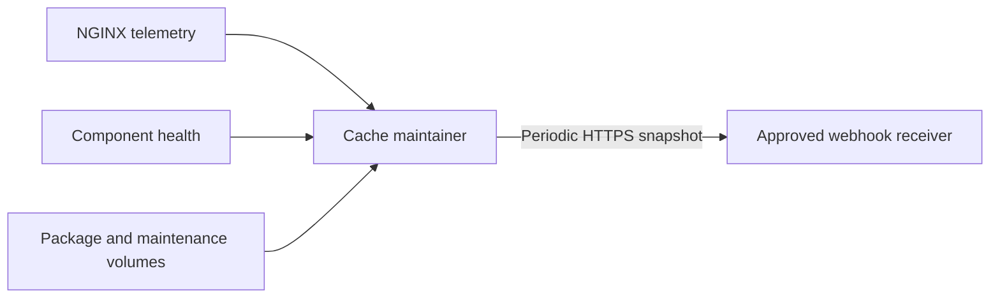

# Webhook monitoring concept

**Status:** Design approved; implementation pending  
**Target component:** `cache-maintainer`  
**Last updated:** 31 August 2026

## 1. Purpose and boundary

The production cache will extend the existing `cache-maintainer` with a
periodic reporter. The reporter sends a current, privacy-bounded service
snapshot to a dynamically configured HTTPS webhook. It does not participate in
package delivery, cache publication, cleanup decisions or gateway readiness.

Webhook failure must never make NGINX, the helper or the maintainer unhealthy,
and must never delay a package request. The reporter runs on a separate bounded
schedule inside the maintainer. An internal self-check cannot prove that the
service is reachable from a managed Mac, so an external HTTPS probe remains
recommended for end-to-end availability monitoring.

No Docker socket will be mounted into the maintainer. Docker Desktop, macOS,
APFS and cold-boot state therefore require host-side or external monitoring.

## 2. Data flow



NGINX's internal event schema must be extended with safe aggregate fields such
as source, status, byte count, latency and range classification. Helper
failures that are not visible in those events need a bounded internal metrics
snapshot or sanitized event path. Neither path may include a package URI,
credential, token or signed URL.

## 3. Proposed configuration

The names below define the implementation contract; they are not active in the
current production image.

| Variable | Default | Purpose |
|---|---:|---|
| `METRICS_WEBHOOK_ENABLED` | `false` | Explicit opt-in switch |
| `METRICS_WEBHOOK_URL` | empty | Exact HTTPS receiver URL |
| `METRICS_WEBHOOK_INTERVAL` | `60s` | Snapshot interval |
| `METRICS_WEBHOOK_TIMEOUT` | `10s` | Per-attempt request timeout |
| `METRICS_WEBHOOK_ALLOWED_HOSTS` | empty | Comma-separated exact receiver hostnames |
| `METRICS_WEBHOOK_AUTH_MODE` | `none` | Planned values: `none`, `hmac`, or an approved alternative |
| `METRICS_WEBHOOK_HMAC_SECRET_FILE` | empty | Preferred protected-file reference for HMAC mode |
| `METRICS_INSTANCE_NAME` | empty | Operator-friendly cache name |
| `METRICS_INSTANCE_UUID` | generated | Explicit stable UUID or persisted generated UUID |
| `METRICS_INSTANCE_FQDN` | empty | Client-facing FQDN |
| `METRICS_PACKAGE_INVENTORY` | `summary` | `none`, `summary`, or `full` |
| `METRICS_PACKAGE_INVENTORY_MAX_ITEMS` | `5000` | Hard cap in `full` mode |

If no UUID is configured, the maintainer generates one once and stores it with
mode `0600` in the maintenance volume, for example at
`/srv/jamf-maintenance/instance-id`. Changing containers must not change the
identity. A missing URL, allowlist or required authentication secret while the
feature is enabled is a startup configuration error for the reporter, but must
not disable cache delivery or cleanup.

## 4. Snapshot contract

Every request uses JSON with a versioned schema. The receiver should treat
unknown fields as forward-compatible additions.

```json
{
  "schema_version": 1,
  "event_id": "3d939480-f681-4ea7-a2f0-07f2e21372cc",
  "sequence": 42,
  "observed_at": "2026-08-31T10:00:00Z",
  "instance": {
    "name": "JCDS Cache Production",
    "uuid": "2b1ab8d0-a064-47ca-af4e-366c53c43f10",
    "fqdn": "jcds-cache.appfruit.ch",
    "version": "v1.0.0",
    "commit": "0123456789abcdef",
    "uptime_seconds": 86400
  },
  "health": {
    "ready": true,
    "gateway_status": 200,
    "checked_at": "2026-08-31T10:00:00Z"
  },
  "storage": {
    "total_bytes": 751619276800,
    "available_bytes": 300647710720,
    "free_percent": 40.0,
    "pressure": false,
    "cleanup_trigger_percent": 30,
    "cleanup_target_percent": 35
  },
  "cache": {
    "package_count": 120,
    "package_bytes": 214748364800,
    "temporary_count": 0,
    "temporary_bytes": 0,
    "index_entries": 120,
    "unindexed_entries": 0,
    "unsafe_entries": 0,
    "inventory_mode": "summary"
  },
  "traffic": {
    "window_seconds": 60,
    "requests": 25,
    "local_hits": 20,
    "jcds_fills": 5,
    "hit_ratio": 0.8,
    "bytes_served": 123456789,
    "bytes_downloaded": 23456789,
    "status_2xx": 24,
    "status_4xx": 1,
    "status_5xx": 0,
    "range_requests": 3,
    "active_fills": 0,
    "failures": 0,
    "integrity_failures": 0,
    "capacity_failures": 0
  },
  "cleanup": {
    "retention_seconds": 7776000,
    "last_result": "not_required",
    "last_completed_at": "2026-08-31T09:55:00Z",
    "removed_files_total": 4,
    "removed_bytes_total": 987654321
  },
  "reporter": {
    "previous_delivery_succeeded": true,
    "consecutive_failures": 0
  }
}
```

Counters should be monotonic since maintainer start unless their names specify
a reporting window. `event_id` supports receiver deduplication; `sequence`
helps detect missed or reordered snapshots. Cleanup result values are
`not_required`, `target_reached`, `target_not_reached`, and `failed`.

## 5. Package inventory and privacy

| Mode | Content |
|---|---|
| `none` | No cache inventory fields beyond operational totals required elsewhere |
| `summary` | Counts, byte totals, index consistency and temporary/unsafe entry counts |
| `full` | Summary plus at most the configured number of `{filename, size_bytes, last_access_at}` records |

`summary` is the production default. `full` is intended only for a trusted
receiver because filenames can disclose software inventory and large lists can
create operational load. Truncation must be explicit in the payload with the
total count and returned count.

The payload and reporter logs must exclude client addresses, Jamf tenant names,
OAuth material, signed URLs, package hashes, raw request IDs, raw headers and
per-client activity. The reporter must never log its request body or
authentication material.

## 6. Transport, authentication and failure behavior

- Accept HTTPS only, reject redirects and require an exact hostname allowlist.
- Apply the same DNS/private-address and SSRF protections used for controlled
  outbound package requests, with explicit approval for the receiver's address
  class where necessary.
- Use a short timeout and bounded exponential retry with jitter.
- Keep only the newest unsent snapshot, or a small explicitly bounded spool;
  monitoring loss must not consume unbounded memory or disk.
- A non-2xx response, timeout or TLS/authentication failure increments reporter
  failure counters and produces one sanitized rate-limited log record.
- Never block package delivery, cleanup, readiness or container health because
  the webhook is unavailable.

HMAC-SHA256 is the recommended authentication mode. The sender would include
`X-JCDS-Timestamp`, an idempotency/event identifier and
`X-JCDS-Signature: sha256=<digest>`, calculated over a documented canonical
combination of timestamp and raw JSON body. The receiver must enforce a clock
window and deduplicate event IDs. The final receiver and authentication method
remain operational decisions; bearer tokens or mTLS may be selected if the
enterprise platform requires them.

## 7. Suggested alerts

- readiness false beyond an agreed grace period;
- no fresh snapshot for two or more expected intervals;
- free space below the cleanup trigger or cleanup unable to reach its target;
- sustained authentication, resolver, fill, integrity or capacity failures;
- abnormal 5xx or incomplete-transfer rate;
- unsafe filesystem entries, stale temporary files or index inconsistency;
- unexpected instance UUID change, restart loop or repeated reporter failure;
- certificate expiry and external HTTPS reachability, measured externally.

## 8. Acceptance tests

Implementation is complete only after automated and target-Mac evidence proves:

1. the feature is disabled by default and requires no webhook configuration;
2. interval, timeout, identity and inventory mode validation fail safely;
3. the stable UUID survives maintainer and container restart;
4. a signed snapshot validates at a mock receiver and retries are bounded;
5. redirects, unapproved hosts, invalid TLS and invalid DNS destinations fail;
6. receiver outage does not affect readiness, package hits/fills or cleanup;
7. inventory modes, item caps, truncation and privacy exclusions are enforced;
8. counters match controlled local-hit, JCDS-fill, range, error and cleanup tests;
9. payload and reporter logs pass disclosure guards; and
10. external monitoring distinguishes container self-health from real client
    reachability.

## 9. Remaining decisions

- webhook receiver product, endpoint owner and retention policy;
- HMAC, bearer token or mTLS authentication and secret-rotation owner;
- receiver hostname/address allowlist and enterprise trust chain;
- alert recipients, thresholds and escalation path;
- whether `full` inventory is permitted in production; and
- bounded retry/spool limits and receiver rate limits.
